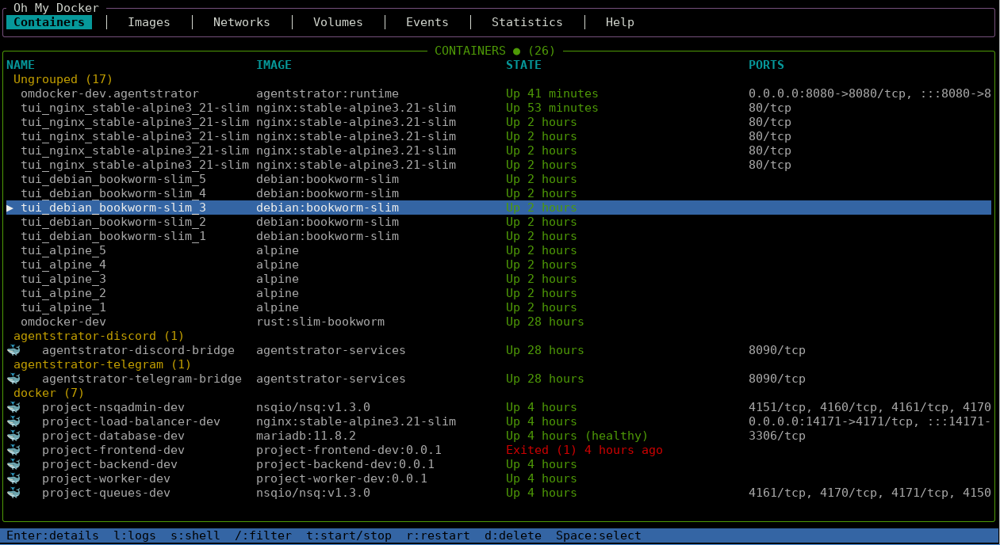

# oh-my-docker (omdocker)

A keyboard-driven Docker TUI (Terminal User Interface) written in Rust.

Fast, minimal, and built for ops workflows — inspired by k9s, lazygit, and htop.



## Quick Start

Download binary from [github releases](https://github.com/supertorpe/oh-my-docker/releases)

...or build it yourself:
```bash
cargo build --release
```
...or build it yourself with Docker:
```bash
mkdir -p .cache && docker run --rm \
	-u $(id -u):$(id -g) \
	-v $PWD:/volume \
	-v $PWD/.cache:/usr/local/cargo/registry \
	-w /volume \
	rust:slim-bookworm \
	cargo build --release
```
Run:
```bash
./target/release/omdocker
```

You can also pass an optional filter argument to pre-filter containers on startup:
```bash
./target/release/omdocker my-service
```

Requires Docker to be installed and the user to have access to the Docker socket.

## Features

- **Container list** — browse running/stopped containers with fuzzy search, optional initial filter via CLI arg
- **Context menus** — right-click on containers for quick access to details, logs, shell, explorer, start/stop, delete. Right-click in file explorer for copy, preview, rename, delete
- **Container details** — inspect metadata, env, volumes, networks, ports, labels; scrollable with `j`/`k`/`PgUp`/`PgDn`
- **Multi-select mode** — press `Space` to enter selection mode, select individual containers, batch start/stop/delete
- **Column picker** — hide/show columns in containers, images, networks, and volumes with `Ctrl+O`
- **Live logs** — streaming with follow mode, pause/resume (`Space`/`p`), reconnect (`r`), search (`/`), scroll, jump-to-top/bottom, timestamp toggle (`T`), export to file (`s`/`Ctrl+S`)
- **Shell access** — `docker exec -it` inside any container with configurable shell (`sh`, `bash`, `/bin/zsh`), user (`root`, `host` → `uid:gid`, or custom `user:group`), and working directory. Config per container persisted to `~/.config/omdocker/omdocker.toml`. TUI suspends, shell runs in the parent terminal, TUI resumes on exit
- **Container file explorer** — browse and transfer files between host and container (`x` to open, `Tab` to switch panels, `Ctrl+C` to copy, `r` to rename, `d` to delete, `R` to refresh)
- **Volume file explorer** — browse Docker volume contents via an ephemeral helper container (`alpine` with `sleep 86400`, created once and reused). Two-panel layout: host filesystem (left) and volume filesystem (right). Supports directory navigation, file delete/rename, refreshing
- **Image management** — list, remove, run containers from images with a configurable run form (command, env, ports, volumes, name, auto-remove, restart policy, memory/CPU limits, network, labels, privileged mode) with inline validation
- **Dangling/prune images** — remove dangling (`<none>`) images with `D`, prune all unused images with `p`
- **Docker events** — real-time event stream with type filtering, scrolling, jump-to-top/bottom
- **Statistics** — live `docker stats` view with CPU %, memory, network I/O, block I/O, PIDs; sortable by column with `←`/`→`, toggle direction with `t`
- **Networks** — list and delete Docker networks with column picker
- **Volumes** — list and delete Docker volumes with column picker
- **Container lifecycle** — start, stop (shows "stopping..."), restart, delete (shows "deleting...") with confirmation dialogs
- **AI diagnostics** — one-key diagnostics (`D`) compiles container context (recent logs, exit code, resource stats, config) and sends it to a local or cloud LLM for root-cause analysis and a repair playbook, displayed in a split side panel
- **Docker reconnection** — automatic periodic reconnection with visual feedback when Docker is unavailable
- **Persistent errors** — red error toasts for critical messages, dismiss with any key; auto-dismissing info toasts
- **Self-update** — background check for new versions on startup (configurable), `U` to check/download, auto-replaces binary
- **Configurable** — polling intervals, column visibility, and keybindings in `~/.config/omdocker/omdocker.toml`
- **Keyboard-first** — all actions available via keys, mouse scrolling supported in explorer panels and scrollable views
- **Fast** — async polling, non-blocking UI, ring buffers for logs/events
- **CLI** — `--help`/`-h`, `--version`/`-V`, and optional filter argument `<search_text>`

## Keybindings

### Global

| Key | Action |
|-----|--------|
| `q` | Quit |
| `?` | Toggle help |
| `Esc` | Go back / close current view |
| `U` | Check for updates / download available update |
| `c` | Switch to Containers view |
| `i` | Switch to Images view |
| `n` | Switch to Networks view |
| `v` | Switch to Volumes view |
| `e` | Switch to Events view |
| `%` | Switch to Statistics view |
| `Tab` | Next tab |
| `Shift+Tab` | Previous tab |

### Containers

| Key | Action |
|-----|--------|
| `j` / `↓` | Navigate down |
| `k` / `↑` | Navigate up |
| `Enter` | Open container details |
| `/` | Activate fuzzy search |
| `l` | Open logs |
| `s` | Open shell (`docker exec -it`) |
| `x` | Open file explorer |
| `t` | Start/stop container |
| `r` | Restart container |
| `d` | Delete container (with confirmation) |
| `D` | AI diagnostics |
| `Space` | Toggle selection mode; in selection mode, toggle single container |
| `Ctrl+A` | Select all filtered containers (in selection mode) |
| `Esc` | Exit selection mode |
| `Ctrl+O` | Toggle column picker |
| Right-click | Open context menu (details, logs, shell, explorer, start/stop, delete) |

### Container Details

| Key | Action |
|-----|--------|
| `l` | Open logs |
| `s` | Open shell |
| `x` | Open file explorer |
| `r` | Restart container |
| `D` | AI diagnostics |
| `t` | Start/Stop container (context-sensitive) |
| `j` / `↑` | Scroll down |
| `k` / `↓` | Scroll up |
| `PgDn` | Scroll down 20 lines |
| `PgUp` | Scroll up 20 lines |
| `g` | Go to top |
| `G` | Go to bottom |
| `Esc` | Back to container list |

### AI Diagnostics

| Key | Action |
|-----|--------|
| `D` | Trigger diagnostics on selected container (from list or details view) |
| `D` / `Esc` | Close diagnostics and return to previous view |
| `j` / `↓` / `PgDn` | Scroll down |
| `k` / `↑` / `PgUp` | Scroll up |
| `g` | Jump to top |
| `G` | Jump to bottom |

Press `D` on any container to trigger AI diagnostics. omdocker compiles a
context vector — recent logs, exit code, resource stats (CPU/mem/net), environment
variables, and container config — and sends it to a configured LLM provider. Results
stream into a split panel: root-cause analysis on the left, step-by-step repair
playbook on the right.

**Requires a configured `[llm]` section in `~/.config/omdocker/omdocker.toml`:**
```toml
[llm]
provider = "ollama"     # or "openai", "anthropic"
model = "llama3"        # any model your provider supports
# base_url = "http://localhost:11434"   # override default endpoint
# api_key = "sk-..."                    # for cloud providers
```
If no `[llm]` section is configured, pressing `D` shows a dialog with setup
instructions. The config file is reloaded on each `D` press — edit the file
from another terminal and the changes take effect immediately without restart.

### Images

| Key | Action |
|-----|--------|
| `j` / `↓` | Navigate down |
| `k` / `↑` | Navigate up |
| `Enter` / `r` | Run container from image (opens config form) |
| `d` | Remove image with confirmation |
| `D` | Remove all dangling (`<none>`) images |
| `p` | Prune all unused images |
| `/` | Activate fuzzy search |
| `Ctrl+O` | Toggle column picker |

### Image Run Form

| Key | Action |
|-----|--------|
| `Tab` / `↓` | Next field |
| `↑` | Previous field |
| `a` | Toggle autoremove / cycle restart policy / toggle privileged |
| `Ctrl+A` | Toggle advanced options |
| `Enter` | Create and run container |
| `Esc` | Cancel |

Fields: Command, Shell, User, Workdir, Env Vars, Port Mapping, Volumes, Container Name, Auto-remove, Restart Policy, Memory Limit, CPU Limit, Network, Labels, Privileged.

### Shell Config Form

| Key | Action |
|-----|--------|
| `Tab` / `↓` | Next field |
| `↑` | Previous field |
| `Enter` | Save config + launch shell |
| `Esc` | Cancel |

Three fields: **Shell** (`sh`, `bash`, `/bin/zsh`, etc.), **User** (empty=default, `host`=uid:gid, `root`, or `user:group`), **Workdir** (empty=default or custom path). Per-container config is persisted to `~/.config/omdocker/omdocker.toml`.

### Logs

| Key | Action |
|-----|--------|
| `Space` / `p` | Pause/resume auto-scroll |
| `r` | Reconnect (only when paused) |
| `g` | Jump to top |
| `G` | Jump to bottom |
| `/` | Search within logs |
| `j` / `↓` | Scroll down |
| `k` / `↑` | Scroll up |
| `PgUp` / `PgDn` | Scroll 20 lines |
| `T` | Toggle timestamps on/off |
| `s` / `Ctrl+S` | Export logs to file |

### Events

| Key | Action |
|-----|--------|
| `j` / `↓` | Scroll down |
| `k` / `↑` | Scroll up |
| `PgUp` / `PgDn` | Scroll 20 lines |
| `g` | Jump to top |
| `G` | Jump to bottom |
| `/` | Filter events |

### Statistics

| Key | Action |
|-----|--------|
| `←` / `→` | Cycle sort column (name, CPU, memory, net RX, net TX, block read, block write, PIDs) |
| `t` | Toggle sort direction (ascending/descending) |

Live stats for running containers (CPU, memory, network, block I/O, PIDs), updated every 2s.

### Networks

| Key | Action |
|-----|--------|
| `j` / `↓` | Navigate down |
| `k` / `↑` | Navigate up |
| `d` | Delete selected network |
| `/` | Activate filter |
| `Ctrl+O` | Toggle column picker |

### Volumes

| Key | Action |
|-----|--------|
| `j` / `↓` | Navigate down |
| `k` / `↑` | Navigate up |
| `d` | Delete selected volume |
| `Enter` | Open volume file explorer |
| `/` | Activate filter |
| `Ctrl+O` | Toggle column picker |

### Explorer (Container / Volume)

| Key | Action |
|-----|--------|
| `Tab` | Switch between host (left) and container/volume (right) panel (container mode only) |
| `j` / `↓` | Navigate down |
| `k` / `↑` | Navigate up |
| `Enter` | Enter directory |
| `Backspace` | Go up to parent directory |
| `PgUp` / `PgDn` | Jump 20 items |
| `g` | Jump to first item |
| `G` | Jump to last item |
| `Ctrl+C` | Copy selected file between panels (container mode only) |
| `d` | Delete selected file/dir (with confirmation) |
| `r` | Rename selected file/dir |
| `R` | Refresh panel listing |
| `/` | Activate filter |
| `Esc` | Go back / close explorer |
| Mouse wheel | Scroll focused panel |
| Right-click | Open context menu (copy, preview, rename, delete, enter directory) |

### Confirm Dialog

| Key | Action |
|-----|--------|
| `y` / `Y` / `Enter` | Confirm |
| `n` / `N` / `Esc` | Cancel |

## Project Structure

```
src/
  main.rs              — Async tokio event loop, shell exec, TUI lifecycle
  config.rs            — TOML config persistence (~/.config/omdocker/omdocker.toml)
  util.rs              — Shared helpers (scroll offset, format utilities)
  update.rs            — Self-update: GitHub release check, download, binary replace
  app/
    mode.rs            — Mode enum + ModeStack (back navigation, max depth 10)
    state.rs           — AppState with all sub-states
    event.rs           — AppEvent enum + data types + Command enum
    navigation.rs      — NavigationState (groups modal sub-states)
    reducer.rs         — Thin dispatcher, delegates to per-domain reducers; mouse scroll handling
    reducers/
       mod.rs           — Reducer module root
       container.rs     — Container list state reducer
       diagnostics.rs   — AI diagnostics state reducer
       event.rs         — Events state reducer
      statistics.rs    — Statistics state reducer
      network.rs       — Network list state reducer
      volume.rs        — Volume list state reducer
      shell.rs         — Shell config state reducer
      navigation.rs    — Navigation/modal state reducer (modes, confirm dialog, help)
      explorer.rs      — File explorer state reducer (host, container, volume)
    handlers/
      mod.rs           — Shared input handlers (filter input)
      container.rs     — Container list input handler
      image.rs         — Image list + image run form input handler
      log.rs           — Log view input handler
      event.rs         — Events input handler
      statistics.rs    — Statistics input handler
      network.rs       — Network list input handler
      volume.rs        — Volume list input handler
      shell.rs         — Shell + shell config input handler
      navigation.rs    — Details, help, confirm dialog input handler
      explorer.rs      — File explorer input handler (container + volume)
   ui/
     mod.rs             — Shared render utilities (filter bar)
     containers.rs      — Container table with search
     container_details.rs — Parsed metadata display with scrolling
     diagnostics.rs     — AI diagnostics split-panel (analysis + playbook)
     logs.rs            — Ring buffer (10k), follow/pause, search/highlight
    images.rs          — Image table
    image_run.rs       — Image run config form (command, env, ports, volumes, etc.)
    resource_panel.rs  — Reusable resource list panel (used by containers, images, networks, volumes)
    shell.rs           — Shell placeholder/waiting screen
    shell_config.rs    — Shell config form (shell, user, workdir)
    events.rs          — Docker event stream with type coloring + filter
    statistics.rs      — Live docker stats table
    networks.rs        — Network table
    volumes.rs         — Volume table
    explorer.rs        — File explorer panels (host + container/volume)
    help.rs            — Help overlay
    column_picker.rs   — Column picker popup
    confirm_dialog.rs  — Confirm/cancel dialog overlay
    tabs_bar.rs        — Tab bar renderer
    status_bar.rs      — Status bar with container count / Docker status
    theme.rs           — Color theme constants
  docker/
    client.rs          — bollard Docker client (connection / reconnection)
    containers.rs      — List, inspect, start/stop/restart/delete
    diagnostics.rs     — Diagnostic context compiler (logs, stats, exit code, config)
    images.rs          — List, remove, create container from image
    logs.rs            — Streaming log collector
    events.rs          — Docker event stream
    statistics.rs      — Docker stats collector
    networks.rs        — List, remove
    volumes.rs         — List, remove
    explorer.rs        — List files, copy/rename/delete in containers and volumes
  search/
    fuzzy.rs           — fuzzy-matcher wrapper
    mod.rs             — Search module root
  llm/
    mod.rs             — LLM client: prompt builder, curl-backed streaming, JSON parsing (Ollama/OpenAI/Anthropic)
  input/
    handler.rs         — Key dispatcher, routes to handlers by mode
    keys.rs            — KeyCode + Modifiers combinators
    keymap.rs          — KeyMap struct with configurable key bindings
    mod.rs             — Input module root
  runtime/
    mod.rs             — Runtime module root
    tasks.rs           — Async task spawners (pollers, actions, streams)
```

## Architecture

omdocker follows a unidirectional data flow:

```
Terminal input → AppEvent → Reducer → AppState → UI render
```

Async Docker operations (container polling, log streaming, event streaming) run on
background tokio tasks and communicate with the main loop via `mpsc` channels.

Each screen is an independent `Mode` in a state machine. Navigation between screens
uses a `ModeStack` (max depth 10) for back-button support. Destructive actions
(delete, remove) show a confirmation dialog before executing.

Shell access suspends the TUI entirely: the terminal exits raw mode/alternate screen,
`docker exec -it` runs as a blocking child process in the parent terminal, and on
exit the TUI re-initializes and resumes. Per-container shell preferences (shell,
user, workdir) are persisted to `~/.config/omdocker/omdocker.toml`.

The volume file explorer creates a lightweight helper container (`alpine:latest` with
`sleep 86400`) that mounts the target Docker volume. The container is created once and
reused across directory navigations for fast listing via `docker exec`. It is cleaned
up when leaving the volume explorer (via `Command::RemoveVolumeHelper`).

AI diagnostics compile a `DiagnosticContext` (logs, exit code, resource stats,
environment, config) and send it to a configured LLM via `curl`. The response is
parsed into structured `analysis` and `playbook` fields, rendered in a split panel
with severity-aware color coding.

## Dependencies

| Crate | Purpose |
|-------|---------|
| `ratatui` | Terminal UI rendering (flexbox, scrollable blocks, styled text) |
| `crossterm` | Terminal backend + async event stream |
| `tokio` | Async runtime (pollers, streamers, channels) |
| `bollard` | Docker API client |
| `serde` / `serde_json` | Serialization for config and JSON metadata inspection |
| `toml` | Config persistence format |
| `fuzzy-matcher` | Fuzzy search across container/image lists |
| `anyhow` | Error reporting and backtrace formatting |
| `chrono` | Timestamp formatting for logs and events |
| `futures-util` | Async stream utilities (log streaming, stats, event stream) |
| `tar` | Creating/extracting tar archives for file copy operations |
| `ureq` | HTTP client for self-update (GitHub release API) |
| `curl` (CLI) | HTTP client for LLM API calls (diagnostics feature) |

## License

MIT
